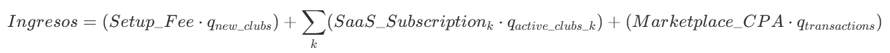

# SocioUnido: Plataforma Inteligente de Gestión y Fidelización para Clubes de Fútbol

## 🎯 Necesidad u oportunidad detectada

Los clubes de fútbol en Argentina sufren tres grandes pérdidas económicas que muchas veces pasan desapercibidas:

- La rotación de socios (abandono o morosidad).
- La evasión en los accesos los días de partido (Préstamo de carnets o capturas de pantalla de códigos QR estáticos).
- Desaprovechamiento de los espacios de uso alquilables por los socios.

Además, las dirigencias y áreas administrativas destinan una cantidad desproporcionada de horas-hombre en tareas repetitivas, como responder consultas, gestionar cobros manuales o administrar el alta de nuevos hinchas.

## 💡 Solución planteada

Desarrollo de una plataforma SaaS (Software as a Service) B2B que centraliza la gestión administrativa del club de fútbol (Abonos, cuotas sociales, accesos al estadio, espacios compartidos) y la potencia con herramientas de fidelización activa y seguridad perimetral.

**Estrategia del producto:**

1. **Prevención y Fidelización:** Pasar de un modelo reactivo (Dar de baja al socio que no paga) a un modelo proactivo, detectando patrones de ausentismo o falta de pago para incentivar la retención antes de que el usuario abandone la institución.
2. **Seguridad y Autogestión:** Optimizar el control en molinetes los días de partido mediante tecnología dinámica offline y automatizar la atención al socio mediante canales conversacionales.
2. **Optimización de espacios:** Refinar el sistema mediante al que se alquilan espacios, o brindan servicios a los usuarios.

## 👥 Clientes objetivos

* **Clubes de Fútbol Argentino:** Instituciones deportivas de diversas categorías que manejan un alto volumen de socios e hinchas, y sufren cuellos de botella en la atención presencial y en el control de accesos al estadio.
* **Usuarios Decisores (Decision Makers):** Presidentes, Comisiones Directivas, Tesoreros o Gerentes Generales del club, cuya motivación principal es maximizar la recaudación, evitar la fuga de capitales por accesos indebidos y modernizar la imagen de la institución hacia el hincha.

## 📱 Medios de uso

* **Plataforma Web (Dashboard B2B):** Panel de control para la administración del club (Finanzas, métricas de retención, estado de la masa societaria).
* **App Móvil / PWA del Socio:** Billetera digital del hincha donde reside su carnet digital dinámico, estado de cuenta, cartelera de beneficios y alquiler de espacios/servicios.
* **Integración WhatsApp:** Canal de atención automatizado 24/7 para consultas de los hinchas.
* **Integración con sistemas existentes:** APIs diseñadas para conectar la validación de tokens directamente con los molinetes de acceso físico del estadio.

## 🤖 Uso de IA y Alta Ingeniería

* **Motor Predictivo de Morosidad (Machine Learning):** Un algoritmo que analiza la frecuencia de asistencia a la cancha y el historial de pagos para detectar socios en "riesgo de fuga". Dispara automáticamente promociones o recordatorios amistosos para re-engancharlos.
* **Asistente Transaccional (NLP / RAG):** Un bot de WhatsApp integrado a la base de datos que entiende lenguaje natural. Permite al socio enviar un audio preguntando "Quiero pagar la cuota de este mes" y el bot le genera el link de pago automáticamente.
* **Smart Access:** Sistema de control de accesos mediante códigos QR dinámicos (Tokens TOTP) que se regeneran cada 15 segundos y funcionan de manera offline. Crucial para estadios donde la conectividad a internet colapsa los días de partido.

## Análisis de las 5Cs

### 1. Compañía

* **Descripción:** Startup de tecnología deportiva que ofrece un ecosistema integral de gestión para clubes de fútbol, combinando administración eficiente, prevención de morosidad y control de socios.
* **Visión:** Ser el sistema operativo estándar para los clubes de fútbol en Argentina, transformando la relación entre el club y el hincha mediante innovación tecnológica.
* **Misión:** Proveer a las comisiones directivas una herramienta inteligente que optimice la administración, blinde los accesos al estadio y fidelice a los hinchas, brindando nuevas vías de monetización.

### 2. Colaboradores

1. **Empresas de Hardware de Control de Acceso:** Para integrar nuestra solución con molinetes y sistemas de validación física en los estadios.
2. **Agencias de Marketing y Sponsors:** Marcas que busquen pautar o generar activaciones directas con la masa societaria a través de la app del club.
3. **AFA y Ligas Regionales:** Entidades rectoras que pueden facilitar la adopción tecnológica en sus torneos.

### 3. Clientes

1. **Segmento B2B Principal:** Clubes de fútbol del ascenso y ligas metropolitanas que buscan profesionalizar su gestión, optimizar su rentabilidad controlando mejor los ingresos de los días de partido y reduciendo la morosidad.
2. **Segmento B2B Expansión:** Clubes de primera división (Liga Profesional y Primera Nacional) con necesidades de alta concurrencia y gestión masiva de socios.

### 4. Competidores

1. **El "Status Quo" (Competencia Directa):** La administración basada en papel, planillas de Excel y carnets físicos de plástico que se prestan o falsifican fácilmente.
2. **Sistemas de Gestión de Clubes Legacy:** Herramientas tradicionales que resuelven gestiones básicas, pero carecen de arquitecturas para alta concurrencia (días de partido), IA predictiva, entre otros features.
3. **Sistemas Informales y Dinámicas Internas:** Entendemos que los clubes de fútbol son instituciones políticas con funcionamientos complejos. Nuestro enfoque no es imponer una "transparencia disruptiva" que entorpezca los asuntos internos o perjudique a la institución. Por el contrario, nos posicionamos como una herramienta operativa orientada a dotar a la dirigencia de mejores mecanismos para **monetizar y controlar el funcionamiento general**, adaptándonos a la realidad de cada club sin forzar fricciones políticas.

### 5. Contexto

| Categoría | Corto Plazo (1-2 años) | Mediano Plazo (3-5 años) | Largo Plazo (+5 años) |
| :--- | :---: | :---: | :---: |
| **Económico** | 🟡 | 🟢 | 🟢 |
| **Regulatorio** | 🟢 | 🟢 | 🟢 |
| **Social / Cultural** | 🟡 | 🟢 | 🟢 |
| **Tecnológico** | 🟢 | 🟢 | 🟢 |
| **Político / Institucional** | 🟡 | 🟡 | 🟢 |

> **Justificación del análisis de contexto:**
> * **Económico:** La recuperación económica Post-pandemia y el aumento del interés en actividades deportivas generan un clima favorable para la adopción de soluciones que optimicen la gestión de clubes. Sin embargo, la inflación y los costos operativos pueden ser un desafío para algunos clubes, lo que hace que la propuesta de valor de SocioUnido (reducción de pérdidas por fraude y abandono) sea aún más relevante.
> * **Político / Institucional:** Existe un fuerte arraigo a las formas tradicionales de gestión. Sin embargo, al presentar la herramienta como un potenciador de ingresos y una mejora en la imagen de gestión de la directiva (Sin inmiscuirse en auditorías externas), se reduce la barrera de adopción institucional.

## Análisis de las 4Ps

### Producto

SocioUnido es una plataforma SaaS B2B modular diseñada exclusivamente para la realidad del fútbol argentino. Es un ecosistema compuesto por cuatro pilares:

* **Dashboard Administrativo (Web):** Centro de comando para la comisión directiva y gerencia, con métricas de recaudación, morosidad, accesos y gestión de espacios/servicios brindados.
* **Aplicación del Hincha/Socio (PWA/Mobile):** Interfaz para el usuario final. Contiene su carnet digital (QR), pagos de cuota social, compra de abonos, **módulo integrado para la compra y venta de entradas a los partidos**, plataforma de alquiler de espacios/servicios y acceso a noticias o tienda del club.
* **Canal Conversacional:** Bot de WhatsApp con NLP para consultas de los hinchas y gestión de pagos automatizada.
* **Módulo de Alta Concurrencia (Estadios):** Generación de Tokens TOTP (QR dinámico offline) capaz de validar miles de accesos por minuto sin depender de la red WiFi/4G del estadio (Implementación futura, no considerada en un primer MVP).

### Plaza

Al ser un producto Cloud-based, la distribución del software es inmediata. La implementación física ocurre únicamente durante el *onboarding* al conectar el software con los molinetes del estadio.

Para definir nuestra estrategia de penetración, analizamos la estructura del fútbol argentino:

| Nivel | Categoría | Cantidad de Clubes |
| :--- | :--- | :--- |
| **1°** | **Liga Profesional** | **30** |
| **2°** | **Primera Nacional** | **36** |
| **3°** | **Primera B Metropolitana** | **22** |
| **3°** | **Torneo Federal A** | **37** |
| **4°** | **Primera C** | **28** |
| **4°** | **Torneo Regional Federal Amateur** | **~330** |
| **5°** | **Torneo Promocional Amateur** | **17** |

#### Estrategia de Penetración de Mercado (Go-To-Market):

Nuestra fase inicial de comercialización **no** apuntará a los equipos de élite. Nos enfocaremos estratégicamente en los clubes que se encuentran entre la **Primera B Metropolitana** y la **Primera C** (87 clubes en total). 

* **Justificación de Fase 1:** La magnitud y estructura organizacional de estos clubes nos permite acceder directamente a los tomadores de decisión (Presidentes o Tesoreros) de manera mucho más ágil, esquivando la densa burocracia y los contratos exclusivos preexistentes de los equipos de Primera División. Es un nicho con necesidades tecnológicas urgentes y presupuestos que justifican la inversión.

* **Visión a Largo Plazo (Fase 2):** Una vez consolidado el producto en el ascenso metropolitano, utilizaremos los casos de éxito, las métricas de mejora en la recaudación y las buenas reseñas operativas para escalar progresivamente hacia la **Primera Nacional** y, finalmente, la **Liga Profesional** (Ascendiendo con estas 2 categorías hasta 153 clubes objetivos totales). 

### Precio

#### Fórmulas de precio y Proyección de Ingresos

La estrategia de monetización de SocioUnido se basa en un "Pricing basado en el Valor" estructurado en tres componentes, como refleja nuestra proyección de ingresos:

  

1. **Setup Fee (Pago Único por Digitalización):** Para los **primeros clientes**, este proceso de configuración e integración será **100% gratuito**. El objetivo es facilitar la adopción, penetrar la industria y generar casos de éxito comprobables. Como contraprestación por esta bonificación, el club deberá aportar personal para acelerar la migración lo más pronto posible y comprometerse a promocionar el nuevo sistema tanto ante otras instituciones deportivas como hacia el público general, dándonos visibilidad. En etapas posteriores de crecimiento, este setup pasará a tener un valor variable basado en la cantidad de socios a digitalizar.
2. **Suscripción Mensual Híbrida (Fijo + Transaccional):** Se abandona el modelo de tarifa plana pura por un sistema mixto. Incluye un costo fijo escalonado por volumen de socios (Que garantiza el mantenimiento del sistema) sumado a un porcentaje (Fee) sobre cada transacción realizada dentro de la plataforma (Pagos de cuotas, compra de entradas, alquileres). El costo se justifica ante la dirigencia, ya que se "paga solo" con el recupero de cuotas atrasadas y la optimización del alquiler de espacios institucionales.
3. **Marketplace CPA (Módulo Opcional de Monetización Conjunta):** SocioUnido habilita la app del hincha como un canal publicitario y de beneficios segmentado. **Este servicio es opcional y las ganancias generadas desde la visualización de la app se distribuyen según el origen del acuerdo comercial**:
   - **Alianzas propias del club:** Si la propaganda o los beneficios provienen de marcas y convenios gestionados directamente por el club, la aplicación se queda con un **10%** del total en concepto de soporte técnico, integración y formateo correcto de la misma.
   - **Empresas provistas por SocioUnido:** Si la plataforma es la que acerca e introduce a las empresas de terceros para pautar en la interfaz, la ganancia neta se divide en un **75% para el club y un **25% para la aplicación**.

#### Estimación de Precios

* **Precio moderado propuesto:**
  * **Setup Fee (Pago único):** **$0 USD (Bonificado)** para los primeros clientes a cambio de co-marketing y asistencia en la migración. A futuro, costo fijo a determinar según padrón societario.
  * **Suscripción Mensual Híbrida:** * **Cargo Fijo:** Entre **$200 USD y $800 USD**. Este tope máximo es estrictamente indicativo para los clubes objetivo de esta primera fase (Ascenso), estimado en base a su volumen de socios. Al escalar a instituciones de Primera División (Liga Profesional), estos rangos fijos deberán ser revisados y ajustados a la magnitud del club.
    * **Cargo Variable (Fee Transaccional):** Entre un **1% y un 5%** por cada transacción procesada por la plataforma.
* **Estimación de ingresos:**
  Enfocándose en la Fase 1 (Entre Primera B y C = 87 clubes), con una penetración del ~12% (10 clubes):
  * **Setup Fees (10 clubes):** $0 USD (Inversión estratégica en posicionamiento).
  * **Cargos Fijos Mensuales (10 clubes, avg. $400):** $4.000 USD/mes.
  * **Cargos Variables (Fee Transaccional):** Escalará exponencialmente a medida que los hinchas adopten la app para pagar sus cuotas y entradas, generando un flujo constante de ingresos automáticos no limitados por un abono fijo.
  * **Flujo proyectado Fijo en un primer año operativo completo:** **$48.000 USD anuales** (Este es el "piso" garantizado, al cual se le debe sumar el volumen dinámico del Fee Transaccional y el potencial Marketplace CPA).

### Promoción

Dado que el cliente es B2B e institucional, la captación se centra en ventas corporativas y relaciones públicas:

* **Venta Consultiva (Outbound B2B):** Contacto directo con dirigentes de la Primera B y C, ofreciendo una "Auditoría de Recaudación".
* **Calculadoras de ROI:** Herramientas interactivas donde el tesorero del club pueda ingresar su cantidad de socios y el valor de la cuota, y el sistema le calcule de forma tangible cuánto dinero adicional ingresaría mensualmente al aplicar la tecnología de retención y QR dinámico.
* **Networking Estratégico:** Asistencia a reuniones de comité, asambleas de representantes y alianzas con consultoras de *Sports Management* que actúen como puente de confianza entre la dirigencia del club y nuestra tecnología.

## Análisis Competitivo y Estrategia de Posicionamiento

Para validar la viabilidad comercial de **SocioUnido**, es fundamental contrastar nuestra propuesta de valor contra los sistemas de gestión deportiva actuales que dominan el mercado del fútbol argentino, tomando como caso de referencia al principal competidor: *Global.fan*.

### 1. Cuadro Comparativo

| Característica / Enfoque | Competidores Actuales (Ej. Global.fan) | SocioUnido |
| :--- | :--- | :--- |
| **Naturaleza del Sistema** | Administrativo y Reactivo (CRUD avanzado). | Predictivo y Proactivo (Basado en IA). |
| **Gestión de Morosidad** | Reporta al usuario que **ya dejó** de pagar. | Predice quién **va a dejar** de pagar (Machine Learning) y acciona preventivamente. |
| **Control de Accesos** | QR dinámico estándar (Depende de buena conectividad del usuario y del molinete). | **Smart Access (TOTP):** Generación de token criptográfico 100% offline. Alta tolerancia a caídas de red en estadios. |
| **Canales de Atención** | Interfaz cerrada (El socio está obligado a ingresar a la App/Web para operar). | **Omnicanalidad NLP:** El socio puede pagar o consultar enviando un audio mediante WhatsApp. |
| **Enfoque de Mercado** | Captación agresiva orientada a la Primera División y clubes de básquet/vóley grandes. | **Estrategia de Nicho (Go-To-Market):** Foco quirúrgico en B Metropolitana, Primera C y Primera Nacional. |

---

### 2. Diferenciales Técnicos y de Negocio Clave

Para superar la oferta actual, SocioUnido no compite en ser un "mejor sistema contable", sino que se posiciona como una **herramienta de inteligencia de negocios y ciberseguridad** que resuelve problemas físicos y operativos reales de los clubes:

* **La Realidad del Molinete (Smart Access Offline):** En los minutos previos a un partido, la aglomeración de gente hace colapsar las redes 4G en las inmediaciones del estadio. Si un carnet digital requiere conexión en ese instante para ser validado, el embudo de ingreso fracasa. SocioUnido utiliza tecnología de **Tokens TOTP** (Time-Based One-Time Password); la aplicación genera un código criptográfico válido sin necesidad de internet, y el molinete lo valida matemáticamente. Es una solución de alta ingeniería para un cuello de botella físico.
* **Retención vs. Cobranza (El Motor Predictivo):** Los sistemas tradicionales entregan listas de morosos para gestión telefónica. SocioUnido analiza datos históricos de asistencia y pagos. Si un socio con asistencia perfecta falta a dos partidos consecutivos, el algoritmo detecta el "riesgo de baja" y dispara acciones automáticas de marketing (Ej. "¡Te extrañamos en la tribuna! Pagá tu cuota acá con un beneficio exclusivo"). Esto transforma la cobranza de deudas en **salvataje de capital**.
* **Fricción Cero en Transacciones (Asistente NLP):** Obligar al hincha a descargar una app adicional, recordar credenciales y loguearse para pagar una cuota atrasada genera fricción. Al habilitar un bot de WhatsApp que entiende lenguaje natural (audios y texto) y devuelve links de pago directos (ej. MercadoPago), se incrementa drásticamente la tasa de conversión y regularización de pagos.

---

### 3. Estrategia de Proyección y Go-To-Market

Nuestra visión comercial reconoce que intentar desplazar a los competidores instalados en los grandes clubes de la Liga Profesional requiere un desgaste político e institucional inviable para una fase inicial. 

Por lo tanto, la estrategia de penetración de SocioUnido se enfoca en el ecosistema del **Ascenso Metropolitano y la Primera Nacional**. 

* **El Argumento de Venta:** Llevamos tecnología de Primera División a clubes donde el contacto con la dirigencia es directo, la política es cercana y el "dolor" económico de perder 100 cuotas sociales (o sufrir fraude en los ingresos) impacta directamente en el presupuesto operativo del mes. 
* **El Modelo:** Mediante nuestro modelo de cobro SaaS escalonado, el club adopta una solución de alta tecnología sin desfinanciarse, ya que el sistema absorbe su propio costo al tapar las fugas de capital preexistentes.
