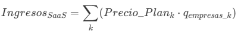
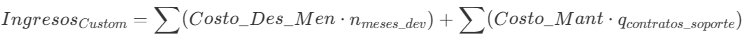

# DevQuest: Plataforma gamificada de "onboarding" para developers

## 🎯 Necesidad u oportunidad detectada

Cuando una empresa contrata a un desarrollador Junior o Semi-Senior, la curva de aprendizaje inicial es muy lenta. Entender la arquitectura, el código heredado y los procesos de la empresa consume incontables horas de los líderes técnicos, lo que genera cuellos de botella y frustración en el equipo de desarrollo.

## 💡 Solución planteada

Desarrollo de una plataforma SaaS (Software as a Service) donde el proceso de "onboarding" se transforma en un "árbol de habilidades" y misiones interactivas.

El nuevo empleado va desbloqueando accesos y subiendo de nivel a medida que completa pequeños *pull requests* de prueba, lee la documentación técnica y aprueba validaciones automáticas, reduciendo la carga sobre el líder técnico.

Estrategia del producto:
1. Árboles de habilidades estandarizados para tecnologías comunes (React, Node.js, Python, etc.) que las empresas pueden personalizar.
2. Customización de misiones específicas para cada empresa, integrando su código y documentación interna.

## 👥 Clientes objetivos

* **Software factories y startups:** Empresas tecnológicas en fase de crecimiento que necesitan incorporar desarrolladores rápidamente sin frenar la producción.
* **Líderes técnicos (CTOs):** Para delegar el proceso de inducción y medir el progreso real del nuevo talento.

## 📱 Medios de uso

* **Plataforma web (SaaS):** Interfaz para el desarrollador (vista de misiones y progreso) y panel de control para el administrador/líder técnico.
* **Integraciones:** Conexión directa con repositorios de código (GitHub, GitLab, Bitbucket) para automatizar la revisión de las misiones.

## 🤖 Uso de IA

* **Análisis estático inteligente:** IA aplicada para revisar automáticamente los *pull requests* de prueba de los nuevos empleados, marcando errores comunes de sintaxis o arquitectura.
* **Asistente (RAG) de documentación:** Un chatbot entrenado exclusivamente con la documentación interna de la empresa que responde dudas técnicas del nuevo desarrollador 24/7 sin interrumpir a los seniors.

## Análisis de las 5Cs

### 1. Compañía

* **Descripción:** Startup de tecnología enfocada en soluciones de recursos humanos para el sector IT, con un producto innovador que gamifica el proceso de inducción de nuevos desarrolladores, reduciendo la carga sobre los líderes técnicos y acelerando la integración del talento.
* **Visión:** Ser la plataforma que erradique por completo la fricción de integrar talento nuevo en equipos de desarrollo, logrando un mundo donde cualquier desarrollador, en cualquier empresa del planeta, alcance su máxima productividad desde el primer día sin depender de la disponibilidad de otra persona.
* **Misión:** Transformando el proceso de onboarding técnico en una experiencia gamificada, autónoma e inteligente, reduciendo la curva de aprendizaje de nuevos desarrolladores y liberando a los líderes técnicos para que se enfoquen en tareas estratégicas en lugar de la inducción manual.

### 2. Colaboradores

1. **Empresas de recursos humanos:** Para la promoción y adopción del producto en el mercado.
2. **Comunidad de desarrolladores (word of mouth):** Para feedback continuo, validación de las misiones y árboles de habilidades, y difusión orgánica de la plataforma a través de recomendaciones entre pares dentro de la comunidad tech.
3. **La ansiedad por la adquisición de nuevas tecnologías:** La velocidad con la que emergen nuevos lenguajes, frameworks y herramientas genera una presión constante en las empresas por capacitar y actualizar a sus equipos. Esta urgencia del mercado actúa como un colaborador natural que impulsa la demanda de soluciones de onboarding estructuradas y escalables como DevQuest.

### 3. Clientes

1. **B2B (empresas):** Software factories, startups tecnológicas, y cualquier empresa que contrate desarrolladores y busque optimizar su proceso de onboarding.
2. **B2C (líderes técnicos):** CTOs y líderes técnicos que buscan una solución para delegar el proceso de inducción y medir el progreso de los nuevos empleados.

### 4. Competidores

1. **El "status quo" (competencia principal):** La desorganización interna. Archivos README desactualizados, horas de "shadowing" improductivo en llamadas por Zoom y flujos de inducción basados en la memoria del líder técnico.
2. **Plataformas de onboarding tradicionales:** Herramientas como BambooHR o Workday que ofrecen módulos de onboarding pero sin la gamificación ni la integración específica para desarrolladores.
3. **Sistemas de gestión de conocimiento:** Plataformas como Confluence o Notion que pueden ser utilizadas para documentar procesos pero no ofrecen una experiencia interactiva ni automatizada para el onboarding de desarrolladores.
4. **Reducción masiva de personal por IA:** La tendencia creciente de empresas que reemplazan roles técnicos con soluciones de inteligencia artificial reduce la cantidad de nuevas contrataciones de desarrolladores, achicando directamente el mercado objetivo de la plataforma.
5. **Modelos de IA generativa como guías de referencia:** Herramientas de IA capaces de generar documentación, guías de onboarding y respuestas técnicas personalizadas bajo demanda, compitiendo directamente con la propuesta de valor del asistente RAG y los árboles de habilidades estructurados de DevQuest.

### 5. Contexto

| Categoría | Corto plazo (1-2 años) | Mediano plazo (3-5 años) | Largo plazo (+5 años) |
| :--- | :---: | :---: | :---: |
| **Económico** | 🟢 | 🟢 | 🟢 |
| **Regulatorio** | 🟢 | 🟢 | 🟢 |
| **Social / cultural** | 🟢 | 🟢 | 🟢 |
| **Tecnológico** | 🟢 | 🟢 | 🟢 |
| **Político / ambiental** | 🟢 | 🟢 | 🟢 |

> **Guía de colores**
> * 🟢 **Verde:** Bueno / favorable.
> * 🟡 **Amarillo:** Intermedio / neutral.
> * 🔴 **Rojo:** Malo / riesgoso.

## Análisis de las 4Ps

### Producto

**DevQuest** es una plataforma integral diseñada para optimizar el ciclo de vida del desarrollador dentro de las organizaciones y descomprimir la carga operativa sobre los líderes técnicos dentro de las empresas de tecnología.

El producto se ofrece bajo dos modalidades estratégicas para cubrir tanto la agilidad de las startups como las necesidades de personalización de las grandes corporaciones:

* **Modelo SaaS estándar (sistema base):** Una solución "llave en mano" con árboles de habilidades precreados para los stacks tecnológicos más comunes (React, Node.js, Python, etc.). Permite una implementación inmediata para empresas que buscan estandarizar su onboarding sin grandes inversiones de tiempo.
* **Proyectos custom enterprise (desarrollo a medida):** Opción de generar un ecosistema de aprendizaje y evaluación diseñado desde cero para las particularidades técnicas y culturales de empresas de gran envergadura. Incluye la creación de misiones exclusivas que integran flujos de trabajo internos y arquitecturas propietarias.
* **Funcionalidades core:** Gamificación mediante árboles de habilidades, validaciones automáticas de *pull requests*, asistente RAG entrenado con documentación interna y análisis estático inteligente mediante IA.
* **Productos asociados y expansión del ecosistema**: DevQuest no es un producto único, sino el núcleo de un ecosistema de soluciones complementarias que se desprenden naturalmente de la plataforma base:
  * **DevQuest certification tracks**: Árboles de habilidades co-creados con entidades certificadoras (ej. AWS, Linux Foundation, Scrum.org) que, al completarse, otorgan al desarrollador vouchers de descuento o créditos para rendir certificaciones oficiales. Genera valor tanto para el empleado como para la empresa.
  * **DevQuest analytics**: Panel de inteligencia de talento para CTOs y Engineering Managers que cruza el desempeño en las misiones de onboarding con métricas de productividad real posteriores, permitiendo predecir qué perfiles se integran mejor y más rápido según la cultura técnica de la empresa.
  * **DevQuest academy**: Versión adaptada de la plataforma orientada a universidades y bootcamps de programación, donde los árboles de habilidades simulan entornos reales de trabajo, reduciendo el gap entre la formación académica y las exigencias del mercado laboral.
  * **DevQuest for teams**: Módulo de reskilling y upskilling para empleados existentes que necesitan adoptar una nueva tecnología, stack o arquitectura dentro de la misma empresa. Extiende el ciclo de vida del cliente más allá del onboarding inicial.
* **Ciclo de vida**: En su fase inicial, el producto se centrará en la adquisición de software factories y startups tecnológicas argentinas como primeros adoptantes. La secuencia de lanzamiento de productos asociados sigue el orden: Primero DevQuest Core, luego Analytics (para profundizar el valor en cuentas existentes), luego Certification Tracks (para reducir CAC vía partnerships) y finalmente Academy y Teams como vectores de expansión de mercado.

### Plaza

Al ser una solución 100% digital orientada al mercado B2B, la "plaza" se define por los canales de distribución tecnológicos y los segmentos corporativos donde ocurrirán las contrataciones del servicio. El lanzamiento se focaliza en Argentina, con infraestructura y modelo preparados para escalar a LATAM.

* **Canales de distribución**: Plataforma web (SaaS) accesible desde navegadores, tanto para la vista del desarrollador (misiones y progreso) como para el panel de administración del líder técnico. La distribución comercial se realiza mediante un sitio web corporativo con modelo de auto-suscripción y un canal de ventas directo (outbound) para cuentas empresariales (Enterprise).
* **Segmentación del mercado argentino**: El mercado objetivo inicial son empresas tecnológicas argentinas con equipos de desarrollo activos. Según datos del sector IT local, Argentina cuenta con más de 4.000 empresas de software registradas (CESSI), de las cuales se estima que un subconjunto relevante incorpora entre 1 y 3 desarrolladores nuevos por mes. Segmentando de forma conservadora:
  * **P1 – Startups tecnológicas en crecimiento (10-50 empleados):** Alta necesidad de escalar equipos rápido sin frenar la producción. Sensibles al precio pero con alta disposición a pagar si el ROI es claro.
  * **P2 – Software factories (50-200 empleados):** Mayor rotación y volumen constante de incorporaciones. Adopción temprana más probable por cultura de proceso.
  * **P3 – Empresas consolidadas con área de IT (200+ empleados):** Proceso de venta más largo pero contratos de mayor valor (Enterprise).
* **Expansión del ecosistema vía alianzas de certificación (partnerships y sponsoreo mutuo)**: La "plaza" trasciende la venta directa B2B al transformar la plataforma en un validador práctico de habilidades avalado por la industria. DevQuest actúa como ecosistema donde el cumplimiento de ciertos árboles de habilidades otorga vouchers para certificaciones oficiales. A cambio, las instituciones certificadoras patrocinan la plataforma, validan el contenido técnico e incluyen a DevQuest en sus redes de partners corporativos. Esta simbiosis disminuye drásticamente el Costo de Adquisición de Clientes (CAC) gracias a la transferencia de autoridad y reputación de marca de los sponsors.

### Precio

#### Fórmulas de precio

El modelo de negocio se divide en dos grandes vías de monetización, diferenciando el producto de escala (SaaS) del producto de consultoría y desarrollo a medida:

**Caso A: Ingresos por suscripción SaaS (recurrente)**

Esta fórmula contempla el crecimiento de la base de clientes que utilizan el sistema estándar con los árboles de habilidades precreados.

  

*Donde 'k' representa los planes (Starter, Growth) y 'q' representa la cantidad de empresas activas.*

**Caso B: Ingresos por proyectos enterprise (desarrollo a medida + soporte)**

Para proyectos donde se genera un árbol específico y un sistema propietario para empresas grandes, se capitaliza tanto la implementación de la app como el mantenimiento recurrente.

  

*Donde el costo de desarrollo mensual es de aproximadamente USD \$4.000 y el mantenimiento varía según el nivel de atención acordado.*

#### Estimación de ingresos

El modelo se basa en una estrategia de **precio por valor**, cuantificando el ahorro directo en horas de líderes técnicos senior.

| Plan / servicio | Descripción | Precio estimado |
| :--- | :--- | :---: |
| **SaaS Starter** | Hasta 3 seats. Árboles estándar y asistente RAG básico. | **USD \$49/mes** |
| **SaaS Growth** | Hasta 10 seats. Customización de misiones y analytics. | **USD \$129/mes** |
| **Enterprise Custom** | Desarrollo de árbol específico y sistema propietario. | **USD \$4.000 / mes de dev** |
| **Mantenimiento básico** | Atención básica, estabilidad y tickets comunes. | **USD \$500/mes** |
| **Soporte premium** | Atención inmediata, específica y soporte dedicado. | **USD \$1.000/mes** |

* **Lógica de ROI:** Una empresa que onboardea 2 developers al mes en el plan Starter ahorra en promedio entre 14x y 28x su inversión en comparación con el costo de horas de un líder técnico senior.
* **Estimación de ingresos (año 1):**
    * **Captura SaaS (~90 clientes):** 60 clientes Starter y 30 Growth generan un subtotal de **USD \$6.540 mensuales**.
    * **Proyectos custom enterprise:** Suponiendo 2 desarrollos a medida de 3 meses cada uno en el año (\$24.000 USD de inyección) y sus respectivos contratos de mantenimiento premium (\$2.000 USD/mes).
    * **Flujo proyectado combinado:** Ingresos recurrentes por **USD \$8.540 mensuales**, más capital variable por desarrollo.

### Promoción

Representa todos los métodos de comunicación para traccionar demos, pruebas gratuitas y conversiones a planes pagos, enfocándose en el ecosistema digital y profesional B2B. La estrategia de promoción se organiza en tres horizontes temporales:

* **Corto plazo – Tracción orgánica (0 a 6 meses):**
  * **Word of mouth en la comunidad dev**: Es el motor principal de adquisición inicial. Un CTO que adopta DevQuest y tiene una buena experiencia lo recomienda naturalmente en sus círculos de confianza (Slack communities, grupos de WhatsApp de tech leads, meetups). Se fomenta activamente con un programa de referidos: cada empresa que refiere un nuevo cliente recibe un mes de suscripción gratuita.
  * **Content marketing técnico**: Publicación de artículos, casos de estudio y benchmarks sobre el costo oculto del onboarding en empresas de software, posicionando a DevQuest como referente de autoridad. Canales: Devto, Medium, LinkedIn y newsletters especializadas en engineering management como *Software Lead Weekly*.

* **Mediano plazo – Amplificación pagada (6 a 18 meses):**
  * **LinkedIn Ads segmentado**: Pauta publicitaria orientada a cargos como CTO, Engineering Manager y Head of People en empresas IT argentinas. Estimación conservadora: un presupuesto inicial de **USD 300-500/mes** apuntando a un CPL (costo por lead) de USD 15-25, lo que genera entre 12 y 33 leads calificados mensuales.
  * **SEO y ASO**: Optimización del sitio web para búsquedas clave como "onboarding developers Argentina", "reducir curva de aprendizaje programadores" y "gamificación equipos técnicos".

* **Largo plazo – Autoridad de marca (18 meses en adelante):**
  * **Relaciones públicas y comunidad**: Participación como sponsor o speaker en eventos del sector tecnológico local (Nerdearla, JSConf, meetups de CESSI), colaboraciones con creadores de contenido enfocados en liderazgo técnico y cultura de ingeniería.
  * **Partnerships de certificación**: Una vez establecidas las alianzas con entidades como AWS o Linux Foundation, DevQuest aparece recomendado en sus redes de partners corporativos, funcionando como canal de distribución pasivo de alto valor con CAC cercano a cero.
  