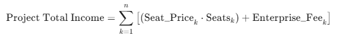

# DevQuest: Plataforma Gamificada de "Onboarding" para Developers

## 🎯 Necesidad u oportunidad detectada

Cuando una empresa contrata a un desarrollador Junior o Semi-Senior, la curva de aprendizaje inicial es muy lenta. Entender la arquitectura, el código heredado y los procesos de la empresa consume incontables horas de los líderes técnicos, lo que genera cuellos de botella y frustración en el equipo de desarrollo.

## 💡 Solución planteada

Desarrollo de una plataforma SaaS (Software as a Service) donde el proceso de "onboarding" se transforma en un "árbol de habilidades" y misiones interactivas.

El nuevo empleado va desbloqueando accesos y subiendo de nivel a medida que completa pequeños *pull requests* de prueba, lee la documentación técnica y aprueba validaciones automáticas, reduciendo la carga sobre el líder técnico.

Estrategia del producto:
1. Árboles de hablidades estandarizados para tecnologías comunes (React, Node.js, Python, etc.) que las empresas pueden personalizar.
2. Customización de misiones específicas para cada empresa, integrando su código y documentación interna.

## 👥 Clientes objetivos

* **Software Factories y Startups:** Empresas tecnológicas en fase de crecimiento que necesitan incorporar desarrolladores rápidamente sin frenar la producción.
* **Líderes Técnicos (CTOs):** Para delegar el proceso de inducción y medir el progreso real del nuevo talento.

## 📱 Medios de uso

* **Plataforma Web (SaaS):** Interfaz para el desarrollador (vista de misiones y progreso) y panel de control para el administrador/líder técnico.
* **Integraciones:** Conexión directa con repositorios de código (GitHub, GitLab, Bitbucket) para automatizar la revisión de las misiones.

## 🤖 Uso de IA

* **Análisis Estático Inteligente:** IA aplicada para revisar automáticamente los *pull requests* de prueba de los nuevos empleados, marcando errores comunes de sintaxis o arquitectura.
* **Asistente (RAG) de Documentación:** Un chatbot entrenado exclusivamente con la documentación interna de la empresa que responde dudas técnicas del nuevo desarrollador 24/7 sin interrumpir a los seniors.

## Análisis de las 5Cs

### 1. Compañía

* **Descripción:** Startup de tecnología enfocada en soluciones de recursos humanos para el sector IT, con un producto innovador que gamifica el proceso de inducción de nuevos desarrolladores, reduciendo la carga sobre los líderes técnicos y acelerando la integración del talento.
* **Visión:** Ser la plataforma de referencia para el onboarding de desarrolladores en empresas tecnológicas, transformando un proceso tradicionalmente tedioso en una experiencia interactiva y eficiente que acelere la productividad desde el primer día.
* **Misión:** Brindar a las empresas tecnológicas una herramienta innovadora que facilite la integración de nuevos desarrolladores, reduciendo la curva de aprendizaje y permitiendo que los líderes técnicos se enfoquen en tareas estratégicas en lugar de la inducción manual.

### 2. Colaboradores

1. **Plataformas de Repositorios de Código:** GitHub, GitLab, Bitbucket para integraciones automáticas.
2. **Empresas de Recursos Humanos:** Para la promoción y adopción del producto en el mercado.
3. **Inversores de Tecnología:** Fondos de inversión interesados en soluciones innovadoras para el sector IT.
4. **Comunidad de Desarrolladores:** Para feedback continuo y validación de las misiones y árboles de habilidades.

### 3. Clientes

1. **B2B (Empresas):** Software factories, startups tecnológicas, y cualquier empresa que contrate desarrolladores y busque optimizar su proceso de onboarding.
2. **B2C (Líderes Técnicos):** CTOs y líderes técnicos que buscan una solución para delegar el proceso de inducción y medir el progreso de los nuevos empleados.

### 4. Competidores

1. **El "Status Quo" (Competencia Principal):** La desorganización interna. Archivos README.md desactualizados, horas de "shadowing" improductivo en llamadas por Zoom y flujos de inducción basados en la memoria del líder técnico.
2. **Plataformas de Onboarding Tradicionales:** Herramientas como BambooHR o Workday que ofrecen módulos de onboarding pero sin la gamificación ni la integración específica para desarrolladores.
3. **Sistemas de Gestión de Conocimiento:** Plataformas como Confluence o Notion que pueden ser utilizadas para documentar procesos pero no ofrecen una experiencia interactiva ni automatizada para el onboarding de desarrolladores.

### 5. Contexto

| Categoría | Corto Plazo (1-2 años) | Mediano Plazo (3-5 años) | Largo Plazo (+5 años) |
| :--- | :---: | :---: | :---: |
| **Económico** | 🟡 | 🟢 | 🟢 |
| **Regulatorio** | 🟢 | 🟢 | 🟢 |
| **Social / Cultural** | 🟢 | 🟢 | 🟢 |
| **Tecnológico** | 🟡 | 🟢 | 🟢 |
| **Político / Ambiental** | 🟢 | 🟢 | 🟢 |

> **Guía de colores**
> * 🟢 **Verde:** Bueno / Favorable.
> * 🟡 **Amarillo:** Intermedio / Neutral.
> * 🔴 **Rojo:** Malo / Riesgoso.

## Análisis de las 4Ps

### Producto

**DevQuest** es un servicio intangible (Plataforma SaaS) diseñado para satisfacer la necesidad de acelerar la curva de aprendizaje de nuevos desarrolladores y descomprimir la carga operativa sobre los líderes técnicos dentro de las empresas de tecnología.

* **Funcionalidad Core**: Plataforma gamificada que transforma el proceso de onboarding en un árbol de habilidades con misiones interactivas. Combina validaciones automáticas de *pull requests*, integración directa con repositorios de código (GitHub, GitLab, Bitbucket), un asistente RAG entrenado con la documentación interna de cada empresa y análisis estático inteligente mediante IA para revisar el código de los nuevos empleados.
* **Ciclo de Vida y Expansión**: En su fase inicial, el producto se centrará en la adquisición de software factories y startups tecnológicas como primeros adoptantes. Está diseñado con la capacidad de expandirse horizontalmente (Sumando árboles de habilidades estandarizados para nuevas tecnologías como Go, Rust o frameworks emergentes) y verticalmente (Adaptando el modelo para otros roles técnicos como QA, DevOps o Data Engineers, o incluso escalando hacia universidades y bootcamps de programación).

### Plaza

Al ser una solución 100% digital y orientada al mercado B2B, la "plaza" se define por los canales de distribución tecnológicos y los segmentos corporativos donde ocurrirán las contrataciones del servicio.

* **Canales de Distribución**: Plataforma Web (SaaS) accesible desde navegadores, tanto para la vista del desarrollador (misiones y progreso) como para el panel de administración del líder técnico. La distribución comercial se realiza mediante un sitio web corporativo con modelo de auto-suscripción y un canal de ventas directo para cuentas empresariales (Enterprise).
* **Segmentación del Mercado**: El tamaño del mercado total (q) se divide en segmentos específicos (P_1, P_2, P_n) que incluyen software factories, startups tecnológicas en fase de crecimiento, empresas consolidadas con equipos de desarrollo grandes y líderes técnicos (CTOs) que buscan profesionalizar su proceso de inducción. La plataforma facilita el acceso ubicuo sin barreras geográficas, permitiendo atender clientes en toda LATAM desde el día uno.
* **Proyección de Ingresos**: Siguiendo el modelo táctico, los ingresos totales del proyecto se calcularán sumando las fuentes de monetización por cada segmento de mercado: La cantidad de empresas suscriptas multiplicada por la tarifa mensual según el plan contratado (escalado por cantidad de desarrolladores onboarded o seats activos).

  

* **Expansión del Ecosistema vía Alianzas de Certificación (Partnerships y Sponsoreo Mutuo)**: La "Plaza" trasciende la venta directa B2B al transformar la plataforma en un validador práctico de habilidades avalado por la industria. Se establece un modelo de distribución y co-marketing mediante alianzas estratégicas con entidades certificadoras (Ej. AWS, Linux Foundation, Scrum.org), academias tecnológicas y fundaciones creadoras de lenguajes/frameworks. DevQuest actúa como un ecosistema donde el cumplimiento de ciertos "Árboles de habilidades" otorga a los desarrolladores vouchers de descuento o créditos para rendir certificaciones oficiales. A cambio, estas instituciones patrocinan la plataforma, validan el contenido técnico de las misiones e incluyen a DevQuest en sus redes de partners corporativos, recomendándolo a sus empresas cliente como el estándar para asentar conocimientos teóricos en repositorios de código reales. Esta simbiosis disminuye drásticamente el Costo de Adquisición de Clientes (CAC) corporativos gracias a la transferencia de autoridad y autoridad de marca de los sponsors.

### Precio

El modelo de monetización se basa en una estructura de suscripción SaaS B2B, aplicando una estrategia de precio por valor, justificada por el ahorro directo en horas de líderes técnicos senior que la plataforma genera para la empresa cliente.

* **Plan por Seats / Desarrolladores**: El precio escala según la cantidad de nuevos desarrolladores que atraviesan el proceso de onboarding en la plataforma, permitiendo que tanto startups pequeñas como software factories grandes accedan al producto de manera proporcional a su necesidad real.
* **Plan Enterprise**: Representa el Valor Diferencial. Las empresas pagan por atributos superiores que justifican el precio: Customización total de árboles de habilidades con el código y documentación interna, integración del asistente RAG entrenado sobre su base de conocimiento privada, métricas avanzadas de progreso y soporte dedicado. El precio de la suscripción debe calcularse considerando la elasticidad de la demanda del sector IT y el costo de oportunidad de las horas de los líderes técnicos, garantizando la supervivencia y rentabilidad (EBIT) de la startup.

### Promoción

Representa todos los métodos de comunicación para traccionar demos, pruebas gratuitas y conversiones a planes pagos, enfocándose en el ecosistema digital y profesional (B2B).

* **Content Marketing Técnico**: Publicación de artículos, casos de estudio y benchmarks sobre costos ocultos del onboarding en empresas de software, posicionando a DevQuest como referente de autoridad en el nicho. Distribución a través de blogs técnicos, Dev.to, Medium y newsletters especializadas en management de ingeniería.
* **Marketing Digital y SEO**: Optimización del sitio web para aparecer en búsquedas clave como "onboarding developers", "reducir curva de aprendizaje programadores" o "gamificación para equipos técnicos", sumado a pauta publicitaria segmentada en LinkedIn Ads orientada a cargos como CTO, Engineering Manager y Head of People en empresas IT.
* **Relaciones Públicas y Comunidad**: Participación en eventos y conferencias del sector tecnológico (Nerdearla, JSConf, meetups locales), colaboraciones con creadores de contenido enfocados en liderazgo técnico y cultura de ingeniería, y programas de referidos entre CTOs para aprovechar el boca a boca característico de la comunidad dev.
